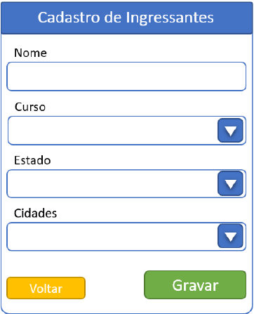
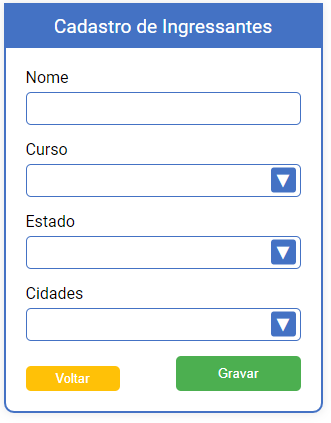
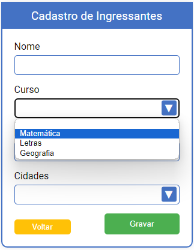
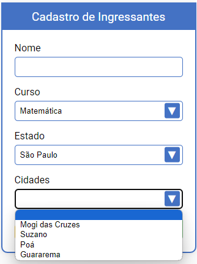
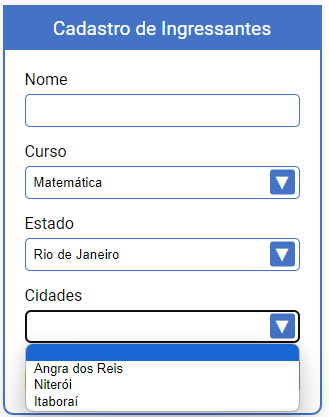
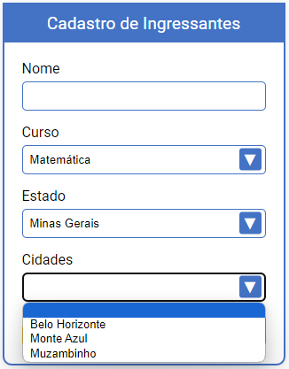

# Muralis - Desafio React.js (Cadastro de Ingressantes)

Este projeto tem como objetivo demonstrar habilidades técnicas em front-end utilizando React.js. O desafio consiste em criar um formulário de cadastramento de ingressantes com base nas seguintes especificações.

## Layout

O formulário deve seguir o seguinte layout:



## Funcionalidades

O formulário deve conter:

1. **Lista de Cursos**
   - Matemática
   - Letras
   - Geografia

2. **Lista de Estados**
   - São Paulo
   - Rio de Janeiro
   - Minas Gerais

3. **Funcionalidade de Preenchimento Automático das Cidades**

   Quando um estado for selecionado, o campo de cidade deve ser preenchido automaticamente com as cidades correspondentes ao estado selecionado:

   - **São Paulo**: Mogi das Cruzes, Suzano, Poá e Guararema
   - **Rio de Janeiro**: Angra dos Reis, Niterói e Itaboraí
   - **Minas Gerais**: Belo Horizonte, Monte Azul e Muzambinho

## Instruções de Uso

1. **Clone o Repositório**
   ```bash
   git clone https://github.com/devLuanRodrigues/muralis-desafio-react

2. **Instale as dependências**
   ```bash
   cd nome-do-repositorio
   npm install


3. **Inicie o servidor de desenvolvimento**
   ```bash
   npm start

4. **Acesse o formulário**
- Abra seu navegador e acesse `http://localhost:3000`

## Estrutura do Projeto

### Descrição dos Diretórios e Arquivos

- **public/**: Contém arquivos públicos que serão servidos diretamente. Inclui o arquivo `index.html`, que é o ponto de entrada HTML do aplicativo, e o `robots.txt` para diretrizes de indexação de mecanismos de busca.

- **src/**: Diretório principal do código fonte do projeto.
  - **assets/**: Diretório para armazenar ativos como imagens, fontes, etc.
  - **components/**: Contém os componentes React do projeto.
    - `formularioCadastro.css`: Arquivo de estilos CSS específico para o componente de formulário de cadastro.
    - `formularioCadastro.jsx`: Componente React que implementa o formulário de cadastro de ingressantes.
  - `index.js`: Arquivo principal do React que serve como ponto de entrada da aplicação.

Essa estrutura ajuda a organizar o código de forma clara e modular, facilitando a manutenção e a escalabilidade do projeto.

## Requisitos
* Node.js
* npm (ou yarn)

## Resultados

### Funcionalidades Implementadas

- **Lista de Cursos**:
  - Matemática
  - Letras
  - Geografia

- **Lista de Estados**:
  - São Paulo
  - Rio de Janeiro
  - Minas Gerais

- **Preenchimento Automático das Cidades**:
  - Para São Paulo: Mogi das Cruzes, Suzano, Poá e Guararema
  - Para Rio de Janeiro: Angra dos Reis, Niterói e Itaboraí
  - Para Minas Gerais: Belo Horizonte, Monte Azul e Muzambinho

### Capturas de Tela

Aqui estão algumas capturas de tela do formulário de cadastramento em funcionamento:

1. **Formulário Inicial**:

   

2. **Selecionando Curso**:

   

3. **Selecionando Estado - São Paulo**:

   

4. **Selecionando Estado - Rio de Janeiro**:

   

5. **Selecionando Estado - Minas Gerais**:

   

### Demonstração

Para uma demonstração em vídeo do funcionamento do formulário, você pode assistir [aqui](src/assets/demo.mp4).

### Agradecimentos

Agradeço a oportunidade de realizar este projeto e estou aberto a feedbacks para melhorias futuras.
